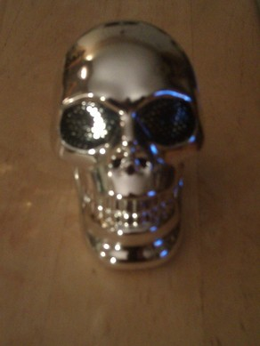

skulltalk
=========

Small set of scripts to create "Bob", my halloween oracle cyberpunk skull

How and why 
---------

So the way I created Bob was to summon, through arcane and unspeakable practices, an ancient and malvolent demon which I bound into the nearest handy receptical, which happened to be computer speakers.  A puff of smoke later and he had transmorgified it to a more comfy set of speaker skulls.

Actually, no.  I found this skull shaped speaker for ten bucks at Walgreen in their Halloween section. I couldn't resist.  So the hardware was cheap, and the eyes glow in some relation of bass and volume and work as a speaker.  The voice of Bob is provided by the festival text-to-speech program.  I used sox to add some padding to the sound-tracks. I also used sox to generate some tracks with just silence, so when I had my playlist on shuffle it wouldn't just be Bob talking non-stop.  It seemed easier than fiddling with too many sound effect programs or trying to come up with my own Android sound app.

